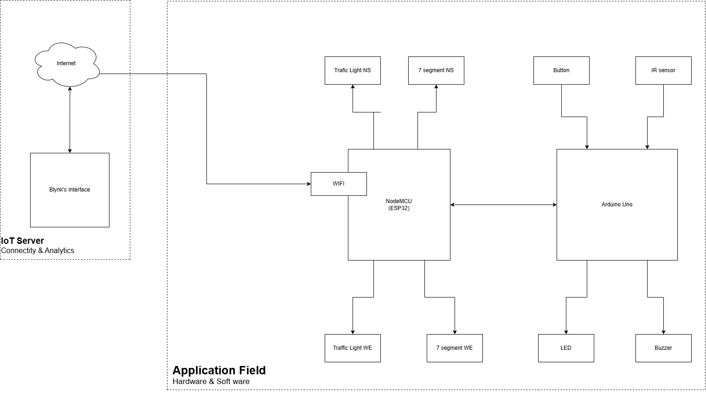
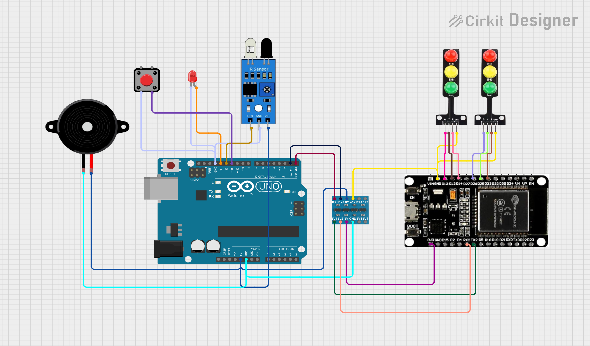
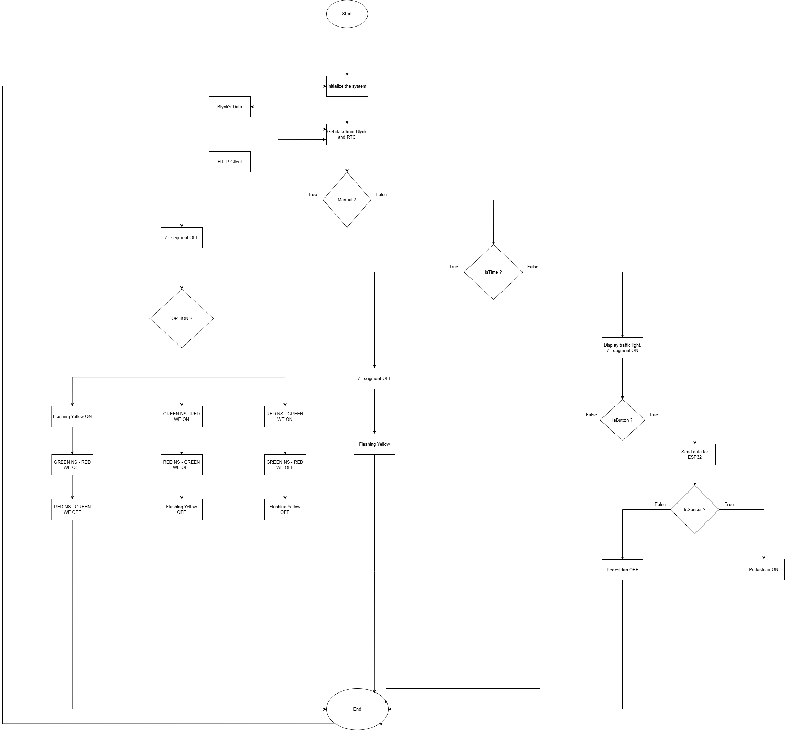

# Wi-Fi-Controlled Smart Traffic Lights

## Project Summary

This project presents an Internet of Things (IoT)-based four-way smart traffic light controller (North-South/West-East - NS/WE) designed to enhance traffic efficiency and pedestrian safety. The system supports two primary operating modes: **Automatic (Auto)** and **Manual**, along with a **Night Flash Mode** scheduled using a Real-Time Clock (RTC).

The architecture is partitioned across two microcontrollers:
* **ESP32 (Master Controller):** Manages all vehicular traffic light phases, controls the four 7-segment countdown displays (via 74HC595D shift registers), handles Wi-Fi connectivity, and communicates with the Blynk Cloud platform.
* **Arduino Uno (Secondary Controller):** Manures the pedestrian subsystem, which includes a push button for crossing requests, an Infrared (IR) sensor for presence validation, a pedestrian indicator LED (Walk/Don't Walk), and an audible buzzer.
* The two microcontrollers communicate with each other using the **UART** serial protocol.

## Key Features

* **Automatic Mode (Auto Mode):** Traffic lights cycle according to pre-set fixed timing, complete with a 7-segment countdown display.
* **Pedestrian Subsystem:**
    * A pedestrian presses the request button.
    * The Arduino waits for a 2-second confirmation period. If the IR sensor detects a person (IR LOW) after this delay, the validated request is sent to the ESP32 (`PEDESTRIAN_REQ` - byte `10`).
    * If no pedestrian is detected by the IR sensor, the request is canceled and a cancel signal is sent (`PEDESTRIAN_CANCEL` - byte `11`).
    * Valid requests are inserted by the ESP32 between vehicular phases with protected clearances (when the conflicting direction is RED).
* **Night Flash Mode:** The system automatically switches to a synchronized yellow flashing mode for all directions (with countdowns disabled) between **23:00 and 06:00** based on RTC synchronization via NTP.
* **Manual Mode:** Operators can manually control the light phases (e.g., advance to the next phase or hold a phase) via the **Blynk Web Dashboard** interface.
* **IoT Platform:** Uses **Blynk Cloud** for remote monitoring and manual control over Wi-Fi.

## System Architecture

The block diagram illustrates the distribution of responsibilities between the ESP32 (traffic management and Wi-Fi) and the Arduino Uno (pedestrian subsystem).

| Block Diagram | Interaction |
| :---: | :--- |
|  | **IoT Server (Blynk/Internet):** Connects to the NodeMCU (ESP32) via Wi-Fi. **NodeMCU (ESP32):** Controls NS/WE Traffic Lights and NS/WE 7-segments. Communicates with the Arduino Uno via UART. **Arduino Uno:** Controls the Button, IR sensor, LED, and Buzzer. Communicates with the NodeMCU (ESP32) via UART. |

## Electronic Components

| Component / Device | Quantity | Details / Remarks |
| :--- | :--- | :--- |
| **ESP32 DevKit V1** | 1 | Main controller (3.3V logic), manages Wi-Fi connection and vehicle traffic phases. |
| **Arduino Uno R3** | 1 | Secondary controller (5V), handles pedestrian logic, IR sensor, and button input. |
| **74HC595D Shift Registers** | 8 | 8-bit serial-in / parallel-out SPI output expanders for 7-segment driving. |
| **7-segment LED Displays** | 4 | 5011BS Common Anode type, two-digit countdown timers for each approach. |
| **Traffic Light LED Modules** | 4 | 5V R/Y/G signal modules (North-South / West-East). |
| **IR Sensor Module** | 1 | 5V reflective IR module, detects pedestrian presence (LOW when detected). |
| **Pedestrian Push Button** | 1 | N.O. momentary tactile button for crossing request (input pull-up). |
| **Buzzer** | 1 | Active buzzer for audible warnings during the pedestrian phase. |
| **Pedestrian Signal LED** | 1 | 3V LED indicator (Walk/Don't Walk) controlled by Arduino. |
| **Logic Level Converter** | 1 | MH bidirectional 3.3V $\leftrightarrow$ 5V converter for UART and 5V component interfacing. |

## Circuit Diagram (Pinout)

| Circuit Diagram | Details |
| :---: | :--- |
|  | Connection diagram illustrating the interface between the Arduino Uno, ESP32, IR sensor, level shifter, and 5V traffic light modules. |

### Detailed Pinout

| Function | Component | ESP32 Pin | Arduino UNO Pin |
| :--- | :--- | :--- | :--- |
| **NS Traffic Light** | RED | GPIO 26 | --- |
| | YELLOW | GPIO 25 | --- |
| | GREEN | GPIO 33 | --- |
| **WE Traffic Light** | RED | GPIO 13 | --- |
| | YELLOW | GPIO 12 | --- |
| | GREEN | GPIO 14 | --- |
| **7-Segment A (NS)** | LATCH | GPIO 15 | --- |
| | CLOCK | GPIO 2 | --- |
| | DATA | GPIO 4 | --- |
| **7-Segment B (WE)** | LATCH | GPIO 5 | --- |
| | CLOCK | GPIO 18 | --- |
| | DATA | GPIO 19 | --- |
| **UART Communication** | RX (from Arduino TX) | GPIO 16 (RX2) | TX (Pin 3) (via converter) |
| | TX (to Arduino RX) | GPIO 17 (TX2) | RX (Pin 2) (via converter) |
| **Push Button** | Signal | --- | Pin 10 (INPUT\_PULLUP) |
| **IR Sensor** | Signal | --- | Pin 11 (INPUT) |
| **Buzzer** | Signal | --- | Pin 12 (OUTPUT) |
| **Pedestrian LED** | Signal | --- | Pin 13 (OUTPUT) |

## Software Setup (Blynk & Wi-Fi)

The system utilizes the Blynk Cloud platform for Wi-Fi management and control.

1.  **Blynk Configuration:** A Template named "Traffic Light" was created in the Blynk Console (Device Type: ESP32, Connectivity: Wi-Fi). The identifiers declared in the ESP32 firmware are:

    ```cpp
    #define BLYNK_TEMPLATE_ID   "TMPL6GlIX1T5U"
    #define BLYNK_TEMPLATE_NAME "Traffic Light"
    #define BLYNK_AUTH_TOKEN    "1FGL5bJGiIjhzNnrVCMEGccnRADRQ9y2" // Rotate for public use
    ```
    *(Note: It is recommended to rotate the `BLYNK_AUTH_TOKEN` for public submissions.)*

2.  **Wi-Fi Configuration:** The Wi-Fi SSID and password must be configured in the ESP32 code (`25FA_SE1931_G5_ESP32_Code_Final_report.ino`):

    ```cpp
    char ssid[] = "Hung 5G";      // Replace with your Wi-Fi SSID
    char pass[] = "0947532540";  // Replace with your Wi-Fi Password
    ```

3.  **Virtual Pin (V-Pin) Mapping on Blynk Dashboard:**
    * `V0`: Switch/Indicator for **Red A** (Lane A = NS).
    * `V1`: Switch/Indicator for **Green A** (Lane A = NS).
    * `V2`: Toggle for **Flash Mode** (0=OFF, 1=ON).
    * `V3`: Toggle for **Manual Mode** (0=AUTO, 1=MANUAL).

## Overall Flowchart

The flowchart illustrates the main system logic, covering initialization, mode checking (Manual/Night Flash), and pedestrian request handling.

| Flowchart | Interaction |
| :---: | :--- |
|  | **Start** -> **Initialize** -> **Get Data (Blynk/HTTP)** -> **Manual?** (True: Manual Mode, False: Check Time) -> **In Time?** (True: Flashing Yellow, False: Run Auto) -> **Pedestrian Request?** (True: Send Data to ESP32, False: Pedestrian OFF) |

## Product Demo

You can view the product demo video at the following link:
[Video Demo (Google Drive)](https://drive.google.com/file/d/1qujsn3CktEX7svxDqckLCqDkyKuDV1A7/view?usp=drive_link)

## Author's Contribution

The project was completed collaboratively by Group 05 - Class SE1931:

| # | Student ID | Student Name | Tasks | Contribution |
| :--- | :--- | :--- | :--- | :--- |
| 1 | SE196636 | Bui Tan Hung | Block diagram, flowchart, PPTX, presentation | 25% |
| 2 | SE190501 | Mai Ngoc Bao | Design model, complete project | 20% |
| 3 | SE182374 | Phan Thanh Dat | Program Arduino and ESP32 coordination logic | 30% |
| 4 | SE193347 | Luong Hoang An | Write report, sub program Arduino and ESP32 | 25% |
